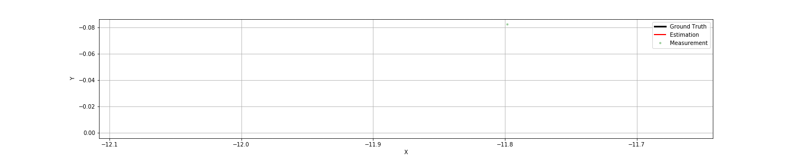
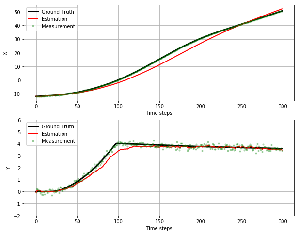
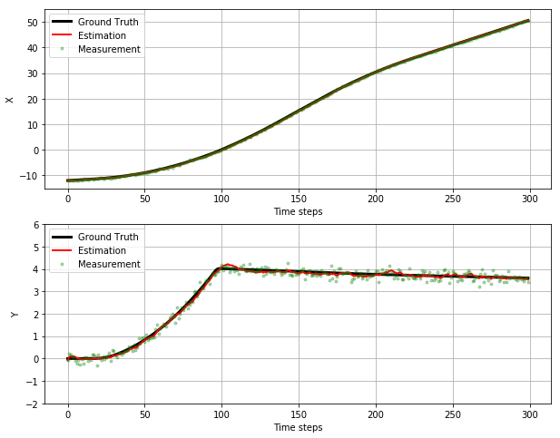

## On the Performance of CTRV Model on Maneuvering Target
The unscented Kalman filter is designed for tracking objects that follow a nonlinear motion model or that are measured by a nonlinear measurement model.  In this note, we evaluate the tracking performance of unscented Kalman Filter on a maneuvering target, with constant turn rate and velocity (CTRV) process model and LIDAR measurement model.

The CTRV process is as following:

We note that the acceleration is not explicitly modeled, i.e., the state vector does not have an acceleration component. Rather, the impact of the acceleration is modeled via process noise component `\nu\_{a, t}`. In the following we show that the value of `\nu\a_{a, t}` has a huge impact on the performance 

#### Ground Truth

#### \nu_a is small

If we set \nu_a = 1, the UKF can not track closely the turn.  We also observe that the estimation of x-position lags the ground truth between time step 50 and 250; it starts to overshoot the ground tuth starting from the time step 270.

#### \nu_a is large

If we set \nu_a = 100, the UKF can track more closely at the turn.  We also observe that the estimation of x-position almost coincides with the ground truth throughout the simulation.

