# Unscented_Kalman_Filter
Unscented Kalman filtering in Python and C++ for tracking and localization


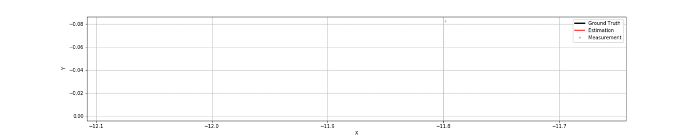


## Introduction

This repo implements an unscented Kalman filter (UKF) class in python, to be further integrated into tracking and localization related projects. I take inspiration from  and am informed by the repos such as:

* https://github.com/rlabbe/filterpy 
* https://github.com/AtsushiSakai/PythonRobotics/tree/master/Localization. 

The requirements for the UKF class are:

* The UKF class should be self-contained -- i.e. it should include all the function blocks within a single class, including the Sigma point generation and update.
* The UKF class should have the flexibility of taking any forms of process and measurement functions as input.
* The UKF class should be able to deal with both additive and non-additive process noise. In particular, the UKF class should have the capability of implementing Sigma points augmentation as often required for non-additive process noise. This capability, to the best of my knowledge, is not adequately addressed in the two repos mentioned above.


### Key Files

* `ukf.py` -- implements the UKF class
* `process_measurement.py` -- implements a few  process and measurement modeld. This script will be regularly updated.
* `ukf_ctrv_test.ipynb` -- an Ipython notebook that illustrates the tracking of highway vehicle using UKF and constant turn rate and velocity (CTRV) model.

## Implementation Notes

#### Sigma Points Augmentation

The possible confusions and difficulties in implementing UKF  could happen in Sigma points augmentation. The augmentation is often needed when the process noise is non-additive. To avoid possible confusions,  I summarize in the following table  the dimension of Sigma points and augmented Sigma points used in state, process, and measurement, respectively. Note that n and n_\a represent the dimension of the (regular) state and augmented state, respectively.

|            | Sigma Points   |Augmented Sigma points |
|---         |---                  |---              |
| State      |  (2n + 1,   n )     | (2n\_a + 1, n_a)  |       
| Process    |  (2n + 1,   n )     | (2n\_a + 1, n  )  | 
| Measurement|  (2n + 1,   n\_z)   | (2n\_a + 1, n_z) |


#### Weights and Sigma Points

The calculation of the weights is implemented as in the following function:

```
def calculate_weights(self):
        """
        Calculate the weights associated with sigma points. The weights depend on parameters dim_x, alpha, beta, 
        and gamma. The number of sigma points required is 2 * dim_x + 1
        """
        # dimension for determining the number of sigma points generated
        dim = self.dim_x if not self.augmentation else self.dim_xa
        if self.sigma_mode == 1:
            lambda_ = self.alpha_**2 * (dim + self.kappa_) - dim
            Wc = np.full(2*dim + 1,  1. / (2*(dim + lambda_))) # 
            Wm = np.full(2*dim + 1,  1. / (2*(dim + lambda_)))
            Wc[0] = lambda_ / (dim + lambda_) + (1. - self.alpha_**2 + self.beta_)
            Wm[0] = lambda_ / (dim + lambda_)
        elif self.sigma_mode == 2:
            lambda_ = 3 - dim
            Wc = np.full(2*dim + 1, 1./ (2*(dim + lambda_)))
            Wm = np.full(2*dim + 1, 1./ (2*(dim + lambda_)))
            Wc[0], Wm[0] = lambda_ /(dim + lambda_), lambda_ /(dim + lambda_)
        
        return (Wc, Wm)

```
Here we consider two approaches (modes). In Mode 1, /lambda not only depends on the dimension of the state (or augmented state), but also on parameters such as /alpha and /kappa. Weights for mean and covariance matrix are calculated (slight) differently. 

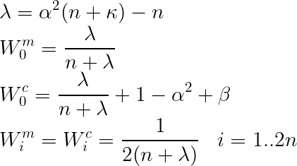

In Mode 2, /lambda depends only on the dimension. In addition, the weights for mean and covariance are the same.  

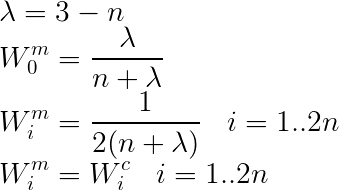


The Sigma points are calculated as the following:

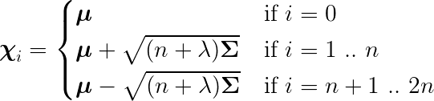

The augmented Sigma points are calculated as the following:

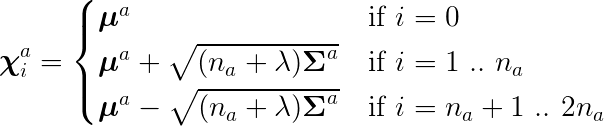

The `update_sigma_pts` calculated the Sigma points or augmented  Sigma points

```
def update_sigma_pts(self):
        """
        Create (update) Sigma points during the prediction stage
        """
        if not self.augmentation:
            dim, x, P = self.dim_x, self.x, self.P
        else:
            dim = self.dim_xa
            x = np.concatenate([self.x, self.xa])
            P = block_diag(self.P, self.Qa)
        if self.sigma_mode == 1:    
            lambda_ = self.alpha_**2 * (dim + self.kappa_) - dim
        elif self.sigma_mode == 2:
            lambda_ = 3 - dim
        U = cholesky((dim + lambda_) * P) 
        self.sigma_pts[0] = x
        for k in range (dim):
            self.sigma_pts[k + 1]  = x + U[k]
            self.sigma_pts[dim + k + 1] = x - U[k]
```

Consider an example of CTRV model, if the impact of the noise is not considered, the process model is as following: 
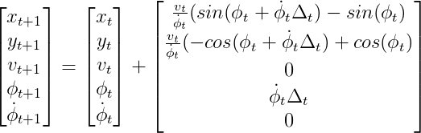

If we also consider the impact of non-additive noise, the process model is as following:
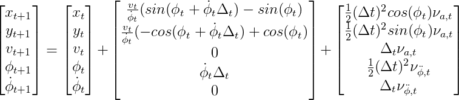.

In this case, the dimension of the state need to augmented. That is, from a regular state of dimension of five, to an augmented state of dimension seven.

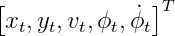


Note that to calculate the augmented Sigma points, we need to use \Sigma_a as follows,

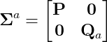

The process noise matrix Q_a is given by

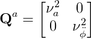

This line implements the above operations:

```
P = block_diag(self.P, self.Qa)
```

#### Prediction

The formula of the prediction stage is given by:

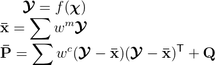

Note that for non-additive noise, the process noise covariance matrix Q, by default, is set to zero.
The computation of process Sigma points is implemented in `compute_process_sigma_pts ()`:

```
def compute_process_sigma_pts(self, input_sigma_pts, **fx_args):
        """
        Calculate the sigam points transformed the process function fx
        Input: 
              input_sigma_pts: input sigma points
              **fx_args: keywords/arguments associated with process/system function defined as fx
        Output:      
              output_sigma_pts: sigma points transformed by the process
        """
        fx, dt = self.fx, self.dt
        n_sigmas, _ = input_sigma_pts.shape
        output_sigma_pts = zeros([n_sigmas, self.dim_x])    
        for i, s in enumerate(input_sigma_pts):
            output_sigma_pts[i] = fx(s, dt, **fx_args)
           
        return output_sigma_pts    
```
The prediction stage is implemented in `prediction ()`, which calls `calculate_mean_covariance (0`

```            
    def prediction(self, **fx_args):
        """
        Prediction, calculated the prior state estimate and covariance
        Input:
              **fx_args: keywords/arguments associated with process/system function defined as fx
        """
        fx = self.fx
        self.update_sigma_pts( )  # update the sigma points
        sigma_pts = self.sigma_pts
        
        process_sigma_pts = self.compute_process_sigma_pts(sigma_pts, **fx_args) # sigma points transformed by the process
        self.sigma_pts_f = process_sigma_pts
        
        # mean and covariance of sigma transformed mean and covariance
        if not self.x_resid:
            self.x, self.P = self.calculate_mean_covariance(process_sigma_pts, self.Q)  
        else:
            self.x, self.P = self.calculate_mean_covariance(process_sigma_pts, self.Q, adjust = True, indices = self.x_resid_indices)
        self.x_prior, self.P_prior = np.copy(self.x), np.copy(self.P)

```

#### Update

The update stage is implemented in `update()`, which calls `compute_measurement_sigma_pts()`.

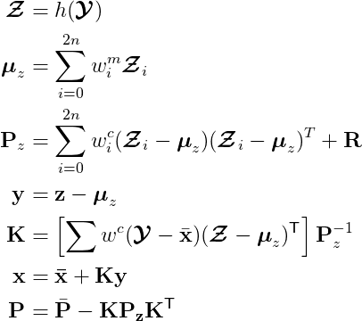

```
def update(self, z, **hx_args):
        
        """
        Update step, calculate the (new) posterior state and covariance
        Input:
             z: measuremnt
             **hx_args: keywords/arguments associated with measurement function defined in hx
        """
        
        hx = self.hx
        sigmas_f = self.sigma_pts_f
        n_sigmas = sigmas_f.shape[0]
        # Transform sigma points from state space to measurement space
        sigmas_h = self.compute_measurement_sigma_pts(sigmas_f, **hx_args) 
        self.sigma_pts_h = sigmas_h
        
        if not self.z_resid:
            zp, Pz = self.calculate_mean_covariance(sigmas_h, self.R)
        else:
            zp, Pz = self.calculate_mean_covariance(sigmas_h, self.R, adjust = True, 
                                                    indices = self.z_resid_indices)
        self.S = Pz
        
        # Compute cross variance of the state and the measurement
        Pxz = np.zeros((self.dim_x, self.dim_z))
        for i in range(n_sigmas):
            x_r = sigmas_f[i] - self.x
            if self.x_resid:
                x_r = self.residual(x_r, self.x_resid_indices)
            z_r = sigmas_h[i] - zp
            if self.z_resid:
                z_r = self.residual(z_r, self.z_resid_indices)
            Pxz += self.Wc[i] * outer(x_r, z_r)
        self.SI = inv(Pz)
        
        K = dot(Pxz, inv(Pz)) # Kalman gain
        self.K = K
        
        # New state estimae and covariance maxtrix
        self.y = z - zp
        self.x = self.x + dot(K, z - zp)
        self.P = self.P - dot(K, Pz).dot(K.T)
        self.x_post = self.x.copy()
        self.P_post = self.P.copy()
        
        self.z = deepcopy(z)
```
